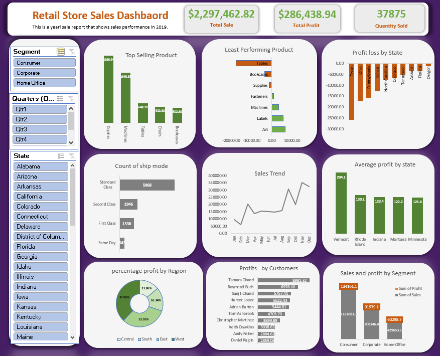

# 📊 Retail Store Sales Dashboard (Excel)

## 📝 Overview  
This project showcases an interactive Retail Store Sales Dashboard built using Microsoft Excel. 
It analyses 2019 retail sales data to help stakeholders monitor performance, 
identify trends, and make data-driven decisions.

---

## ❓ Business Questions Answered

- What was the total sales revenue, profit, and quantity of products sold in 2019?  
- Which products generated the highest and lowest sales?  
- Which states contributed most to profits and which recorded losses?  
- How did sales fluctuate throughout the year—are there seasonal trends?  
- Which shipping modes were most frequently used?  
- Which customers and regions were the most profitable?  
- How did each customer segment (Consumer, Corporate, Home Office) perform in sales and profit?

---

## 🧹 Data Cleaning and Preparation

- **Text to Columns**: Split combined data fields for structure.  
- **Consistency Checks**: Standardised product categories, regions, and segments.  
- **Blank Values**: Reviewed and handled missing data.  
- **Duplicate Removal**: Removed repeated entries.  
- **Date Formatting**: Converted date fields for proper filtering.  
- **Numerical Conversion**: Reformatted key figures for analysis.

---

## 💡 Key Features

- Interactive slicers for filtering by state, quarter, and customer segment  
- KPI panel showing Total Sales, Profit, and Quantity  
- Top and Bottom Product Analysis  
- Geographic Profit Visualisation by state  
- Shipping Mode Analysis (frequency and preference)  
- Monthly Sales Trend Analysis  
- Top Profitable Customers  
- Regional and Segment Performance Breakdown

---

## 📊 Tools Used

- Microsoft Excel  
- Pivot Tables  
- Slicers  
- Bar, Line, and Pie Charts  
- Conditional Formatting

---

## 📷 Dashboard Preview

- 👤 Author
- Orjiude Esther Obianuju
- Data Analyst | Excel • Power BI • SQL • Python
- 🔗 www.linkedin.com/in/orjiude-esther 

